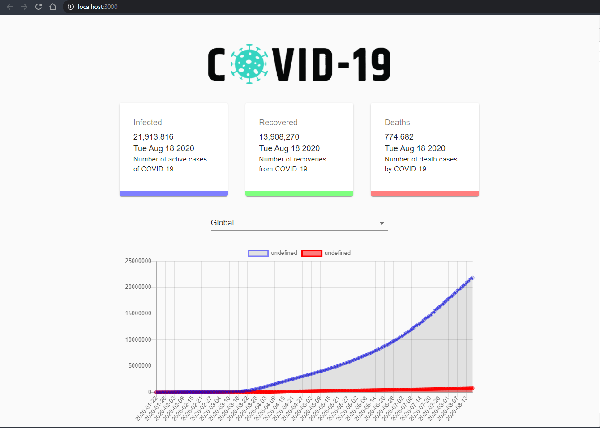
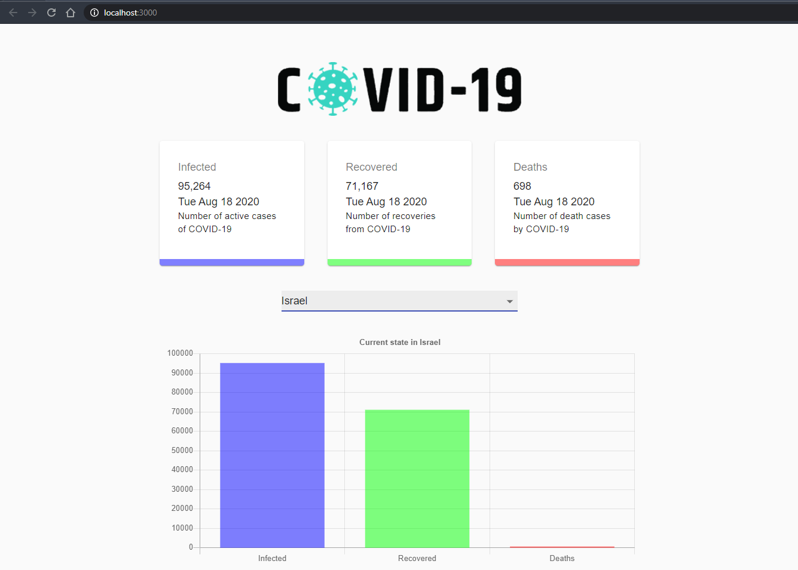

# COVID-19 Tracker # 
COVID-19 Tracker using the API: https://covid19.mathdro.id/api.

[**Live Site :v:**](https://perachbd.github.io/COVID-19_Tracker/)

## Tecnolegis: ##
React
### Main packages: ### 
* Chart.js - Simple yet flexible JavaScript charting for designers & developers
* Material UI - React components for faster and easier web development.

### Setup: ###
run `npm i && npm start`

### Snapshots: ###

